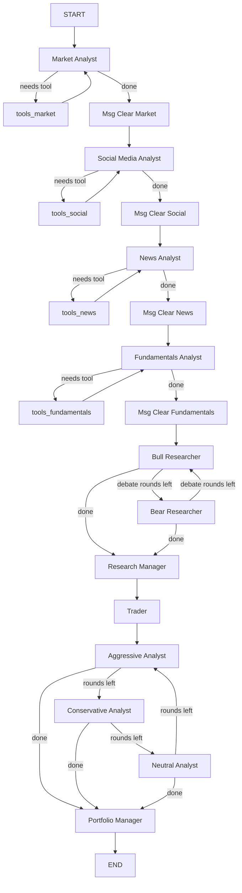

# TradingAgents Codebase Overview

## What is it?

**TradingAgents** is a multi-agent LLM framework that mirrors a real-world trading firm. It uses [LangGraph](https://github.com/langchain-ai/langgraph) to orchestrate a pipeline of specialized AI agents — from market analysts to a portfolio manager — that collaboratively evaluate a stock and produce a final BUY/HOLD/SELL decision.

> Research paper: [arXiv 2412.20138](https://arxiv.org/abs/2412.20138)

---

## Repository Structure

```
TradingAgents/
├── tradingagents/          # Core library package
│   ├── agents/             # All LLM agent definitions
│   │   ├── analysts/       # 4 analyst agents
│   │   ├── researchers/    # Bull + Bear researchers
│   │   ├── risk_mgmt/      # 3 risk debate agents
│   │   ├── managers/       # Research Manager + Portfolio Manager
│   │   ├── trader/         # Trader agent
│   │   └── utils/          # State, tools, memory
│   ├── graph/              # LangGraph orchestration
│   │   ├── trading_graph.py      # Main entry point class
│   │   ├── setup.py              # Graph construction
│   │   ├── conditional_logic.py  # Edge routing logic
│   │   ├── propagation.py        # Graph invocation
│   │   ├── reflection.py         # Post-trade learning
│   │   └── signal_processing.py  # Parse final decision
│   ├── dataflows/          # Data vendor abstraction
│   │   ├── interface.py          # Routing layer (yfinance / Alpha Vantage)
│   │   ├── y_finance.py          # yfinance implementations
│   │   ├── yfinance_news.py      # News via yfinance
│   │   ├── alpha_vantage*.py     # Alpha Vantage implementations
│   │   └── config.py             # Runtime config accessor
│   ├── llm_clients/        # LLM provider abstraction
│   │   ├── factory.py            # create_llm_client() factory
│   │   ├── base_client.py        # Abstract base class
│   │   ├── openai_client.py      # OpenAI / Ollama / OpenRouter / xAI
│   │   ├── anthropic_client.py   # Anthropic (Claude)
│   │   ├── google_client.py      # Google (Gemini)
│   │   └── model_catalog.py      # Supported model list
│   └── default_config.py   # Default configuration dictionary
├── cli/                    # Interactive CLI (Rich-based TUI)
├── tests/                  # Test suite
├── main.py                 # Simple usage example
├── pyproject.toml          # Package metadata / dependencies
└── Dockerfile / docker-compose.yml
```

---

## Agent Pipeline (LangGraph Workflow)

The pipeline is a **directed state graph** compiled in [graph/setup.py](file:///d:/TradingAgents/tradingagents/graph/setup.py). Below is the execution flow:



> Analysts can be selected/deselected. The 4 defaults are: [market](file:///d:/TradingAgents/tradingagents/agents/analysts/market_analyst.py#13-87), [social](file:///d:/TradingAgents/tradingagents/graph/conditional_logic.py#22-29), [news](file:///d:/TradingAgents/tradingagents/graph/conditional_logic.py#30-37), [fundamentals](file:///d:/TradingAgents/tradingagents/graph/conditional_logic.py#38-45).

---

## Agent Roles

### Analyst Team (Phase 1)
Each analyst uses tool calls in a loop until it has enough data, then writes a report into [AgentState](file:///d:/TradingAgents/tradingagents/agents/utils/agent_states.py#46-73).

| Agent | State Field | Tools Used |
|-------|-------------|-----------|
| `Market Analyst` | `market_report` | `get_stock_data`, `get_indicators` |
| `Social Media Analyst` | `sentiment_report` | `get_news` |
| `News Analyst` | `news_report` | `get_news`, `get_global_news`, `get_insider_transactions` |
| `Fundamentals Analyst` | `fundamentals_report` | `get_fundamentals`, `get_balance_sheet`, `get_cashflow`, `get_income_statement` |

After each analyst completes, a **Msg Clear** node wipes the message history (for Anthropic compatibility) before the next analyst starts.

### Researcher Team (Phase 2) — Debate
- **Bull Researcher**: Makes the bullish case using all 4 analyst reports + its own [FinancialSituationMemory](file:///d:/TradingAgents/tradingagents/agents/utils/memory.py#12-99).
- **Bear Researcher**: Makes the bearish case similarly.
- They alternate for `max_debate_rounds` rounds, tracked in [InvestDebateState](file:///d:/TradingAgents/tradingagents/agents/utils/agent_states.py#7-18).
- **Research Manager** (deep LLM): Reads the full debate + its own memory → produces an `investment_plan`.

### Trader (Phase 3)
- Uses the `investment_plan` + its own memory to produce a `trader_investment_plan`.

### Risk Management Team (Phase 4) — Debate
Three risk analysts debate the trading plan:
- **Aggressive Analyst**: Pushes for higher risk/return
- **Conservative Analyst**: Advocates caution
- **Neutral Analyst**: Balances both views
- They rotate for `max_risk_discuss_rounds` rounds, tracked in [RiskDebateState](file:///d:/TradingAgents/tradingagents/agents/utils/agent_states.py#21-44).
- **Portfolio Manager** (deep LLM): Makes the `final_trade_decision` (BUY/HOLD/SELL with rationale).

---

## State Management

Two TypedDicts track sub-debate state, nested inside [AgentState](file:///d:/TradingAgents/tradingagents/agents/utils/agent_states.py#46-73):

```python
class InvestDebateState(TypedDict):
    bull_history, bear_history, history, current_response, judge_decision, count

class RiskDebateState(TypedDict):
    aggressive_history, conservative_history, neutral_history,
    history, latest_speaker, judge_decision, count

class AgentState(MessagesState):  # extends LangGraph MessagesState
    company_of_interest, trade_date, sender
    market_report, sentiment_report, news_report, fundamentals_report
    investment_debate_state: InvestDebateState
    investment_plan, trader_investment_plan
    risk_debate_state: RiskDebateState
    final_trade_decision
```

---

## Memory System ([FinancialSituationMemory](file:///d:/TradingAgents/tradingagents/agents/utils/memory.py#12-99))

Each key agent (bull, bear, trader, invest_judge, portfolio_manager) has its own **in-process BM25 memory**:
- Stores [(situation, recommendation)](file:///d:/TradingAgents/tradingagents/agents/utils/memory.py#94-99) pairs
- On each run, retrieves the most similar past situation via BM25 ranking
- This memory is injected into the agent's prompt to improve decisions over time
- After a trade, [reflect_and_remember()](file:///d:/TradingAgents/tradingagents/graph/trading_graph.py#269-286) is called with the actual returns — the [Reflector](file:///d:/TradingAgents/tradingagents/graph/reflection.py#6-121) class uses an LLM to generate a lesson and stores it in each agent's memory.

---

## LLM Client Abstraction (`llm_clients/`)

[create_llm_client(provider, model, ...)](file:///d:/TradingAgents/tradingagents/llm_clients/factory.py#9-50) returns a `BaseLLMClient` with a `.get_llm()` method.

| Provider | Client Class | Notes |
|----------|-------------|-------|
| `openai` | `OpenAIClient` | Default |
| `ollama` | `OpenAIClient` | OpenAI-compatible endpoint |
| `openrouter` | `OpenAIClient` | OpenAI-compatible endpoint |
| `xai` | `OpenAIClient` | OpenAI-compatible endpoint |
| `anthropic` | `AnthropicClient` | Effort control supported |
| `google` | `GoogleClient` | Thinking level supported |

Two LLMs are configured:
- **`deep_think_llm`**: Used for Research Manager, Portfolio Manager (complex reasoning)
- **`quick_think_llm`**: Used for all other agents (speed & cost)

---

## Data Vendor Abstraction (`dataflows/`)

All data tools go through [interface.py](file:///d:/TradingAgents/tradingagents/dataflows/interface.py)'s [route_to_vendor()](file:///d:/TradingAgents/tradingagents/dataflows/interface.py#134-163) which selects the implementation based on config:

```
Tool call → route_to_vendor(method) → get_vendor(category) → vendor implementation
```

Two vendors supported: **yfinance** (default, free) and **Alpha Vantage** (paid, more data).

If Alpha Vantage hits a rate limit, it automatically **falls back to yfinance**.

Tool categories:
- `core_stock_apis` → `get_stock_data`
- `technical_indicators` → `get_indicators` (MACD, RSI, Bollinger, SMA, EMA, ATR, VWMA…)
- `fundamental_data` → `get_fundamentals`, `get_balance_sheet`, `get_cashflow`, `get_income_statement`
- `news_data` → `get_news`, `get_global_news`, `get_insider_transactions`

---

## Configuration ([default_config.py](file:///d:/TradingAgents/tradingagents/default_config.py))

```python
DEFAULT_CONFIG = {
    "llm_provider": "openai",
    "deep_think_llm": "gpt-5.4",
    "quick_think_llm": "gpt-5.4-mini",
    "max_debate_rounds": 1,        # Bull/Bear rounds
    "max_risk_discuss_rounds": 1,  # Risk team rounds
    "output_language": "English",  # Analyst report language
    "data_vendors": {
        "core_stock_apis": "yfinance",
        "technical_indicators": "yfinance",
        "fundamental_data": "yfinance",
        "news_data": "yfinance",
    },
    "tool_vendors": {},            # Fine-grained tool-level overrides
}
```

Provider-specific tuning: `google_thinking_level`, `openai_reasoning_effort`, `anthropic_effort`.

---

## Entry Points

### Python API
```python
from tradingagents.graph.trading_graph import TradingAgentsGraph
from tradingagents.default_config import DEFAULT_CONFIG

ta = TradingAgentsGraph(debug=True, config=DEFAULT_CONFIG.copy())
_, decision = ta.propagate("NVDA", "2026-01-15")
print(decision)  # "BUY" / "HOLD" / "SELL"
```

### CLI
```bash
tradingagents          # or: python -m cli.main
```
Interactive TUI (Rich-based) lets you select ticker, date, LLM provider, analysts, and research depth.

### Docker
```bash
cp .env.example .env
docker compose run --rm tradingagents
```

---

## Output & Logging

After each [propagate()](file:///d:/TradingAgents/tradingagents/graph/trading_graph.py#194-228) call, results are saved to:
```
results/<TICKER>/TradingAgentsStrategy_logs/full_states_log_<date>.json
```
The JSON includes all analyst reports, full debate histories, trader plan, risk debate, and final decision.
